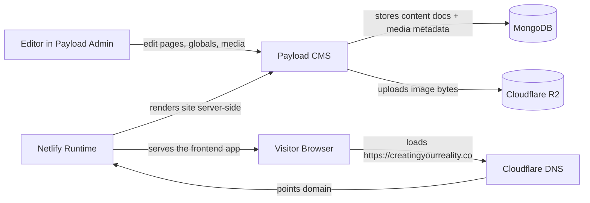

# System Design

This repo is a CMS-driven public site, not the core app platform. The important architectural split is:

- Payload manages editable content.
- MongoDB stores CMS documents and metadata.
- Cloudflare R2 stores uploaded media files.
- Netlify hosts the web app runtime.
- Cloudflare DNS routes the public domain.

## High-Level Diagram

## How The Stack Fits Together

### What Payload owns

- homepage and philosophy page content
- header and footer content
- media records and metadata
- drafts, titles, slugs, SEO fields

### What the infrastructure owns

- MongoDB: content storage
- R2: file storage
- Netlify: app hosting
- Cloudflare: DNS and domain routing

### What still lives in config/env

- `DATABASE_URI` / `MONGODB_URI`
- `PAYLOAD_SECRET`
- `NEXT_PUBLIC_SERVER_URL`
- R2 credentials and public URL
- beta form and external embed links

## Stack Decision Notes

### Why this repo does not use Postgres

You already built this site on Payload + MongoDB, and that is a good fit for the CMS workflow here. The site does not need the operational overhead of Postgres just to manage editorial content.

### Where D1 fits

D1 is a Cloudflare-native SQLite database. It is most useful when the app runtime is also Cloudflare-native, or when you want a lightweight relational database inside the Cloudflare ecosystem.

For this repo, D1 is not the database for the CMS site. The repo is using MongoDB instead.

### Where SQLite fits

SQLite is still useful for:

- local-first app data
- lightweight sync stores
- Python or Swift tooling
- small embedded app databases

That makes SQLite a strong candidate for `timebite-platform`, but not the CMS website itself.

## Launch Order

The practical order for this repo is:

1. Set up the repo and local app.
2. Connect Payload to MongoDB.
3. Wire Cloudflare R2 for media.
4. Set up Netlify.
5. Deploy the app.
6. Upload one image in Payload and confirm it renders locally.
7. Push/deploy and confirm the same image renders live.
8. Point `creatingyourreality.co` at the Netlify deployment through Cloudflare DNS.

If MongoDB and Payload are already set up, that is fine. The remaining important milestone is the R2 image smoke test.

## R2 Smoke Test

Use this as the live proof that media is working end-to-end:

1. Create the R2 bucket and access keys.
2. Add the R2 env vars.
3. Wire the media adapter.
4. Start the app locally.
5. Upload a single image through Payload.
6. Confirm it renders in the admin preview and frontend.
7. Redeploy the app.
8. Confirm the same image still renders live.

